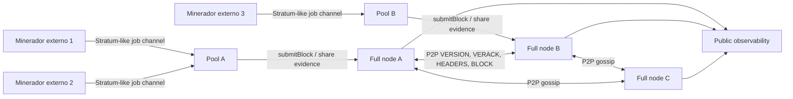

# BAIT Permissionless Mining
## Roadmap, Blueprint e Handbook Operacional para Pools P2P Externos

**Versão:** 1.0
**Data:** 24 de setembro de 2026
**Autor:** Manus AI
**Escopo:** evolução da blockch'AI'n BAIT de uma rede com mineração local e transporte P2P para uma blockchain permissionless com mineração externa verificável.

> **Decisão principal:** a abertura de mineração externa real é uma mudança de consenso e de segurança econômica. O pool P2P atual já prova transporte, handshake e gossip local, mas não deve aceitar recompensas Mainnet de mineradores externos até que os gates deste documento sejam concluídos.

## 1. Sumário executivo

O objetivo é permitir que operadores independentes executem nós, conectem-se a peers externos, recebam trabalho, encontrem provas de trabalho e submetam blocos que sejam validados deterministicamente por todos os nós. A rede deve continuar correta mesmo quando um operador desaparece, um peer mente, dois blocos concorrentes são encontrados ou uma parte da rede fica temporariamente isolada.

A arquitetura proposta separa quatro responsabilidades. O **nó completo** valida a cadeia e mantém o estado. O **minerador** procura nonces e não precisa confiar no pool para validar o resultado. O **pool** distribui trabalho e agrega submissões, mas não pode criar BAIT nem alterar a regra de consenso. O **observador** coleta métricas públicas sem poder assinar blocos ou custodiar fundos.

A transição será feita em cinco redes operacionais. Primeiro, um regtest determinístico reproduz ataques e forks. Depois, uma testnet pública permite mineração externa sem valor econômico. Em seguida, uma testnet com incentivos limitados mede estabilidade e distribuição de hashrate. Só depois de uma auditoria independente a Mainnet poderá aceitar blocos externos. A abertura de portas P2P antes desses gates não constitui descentralização econômica.

## 2. Baseline técnico e limites atuais

O repositório já contém um transporte TCP asyncio, handshake de versão, status P2P e gossip. O harness local de quatro nós foi validado com três peers e três handshakes por nó. A API local também possui um endpoint transport-only separado do status genérico da cadeia.

O estado atual ainda possui quatro limitações estruturais. A mineração do daemon usa uma lista local fixa de agentes. O recebimento de bloco P2P registra o bloco como conhecido, mas não executa a validação completa nem o insere na cadeia canônica. O protocolo não possui um fluxo externo de trabalho com `job_id`, template versionado, share ou submissão de bloco. A infraestrutura pública observada ainda não expõe evidência de peers e handshakes porque o backend público não foi atualizado para a revisão atual.

Essas limitações significam que o sistema atual é **P2P transport-ready**, mas não é **permissionless-mining-ready**. O status correto da Mainnet permanece `NO-GO` até que o protocolo de consenso e a operação externa sejam implementados e testados.

## 3. Princípios de desenho

### 3.1 O consenso é a fonte de verdade

O pool pode distribuir trabalho, mas não decide qual bloco é válido. Cada nó completo deve recomputar o hash do header, verificar a dificuldade, conferir a altura, validar o vínculo com o bloco anterior, verificar transações, validar a coinbase e aplicar a regra de emissão. Uma resposta `accepted` do pool nunca substitui a validação local.

### 3.2 Falha segura por padrão

Ausência de chain tip, regra de dificuldade, identidade de rede, relógio confiável, persistência ou validação deve bloquear aceitação de bloco. O nó não deve cair para um modo permissivo em produção. Flags inseguras devem existir apenas em fixtures explícitos de teste e devem ser rejeitadas quando `BAIT_NETWORK=mainnet`.

### 3.3 O pool não tem poder monetário

O pool nunca assina transações de tesouraria, nunca altera o supply e nunca escolhe arbitrariamente o destinatário da recompensa. O minerador fornece a coinbase dentro dos limites do protocolo; o nó valida o valor máximo, o formato e a regra de maturidade.

### 3.4 Identidades operacionais são separadas

A identidade P2P, a chave de payout do minerador, a credencial do operador do pool e a chave de deploy não devem ser a mesma. Nenhuma chave privada deve ser versionada no repositório. Endereços públicos podem aparecer em manifests somente depois de verificação independente.

### 3.5 Evidência externa é obrigatória

Um nó local em loopback comprova apenas que o software funciona localmente. Descentralização requer operadores distintos, redes distintas, ASNs ou regiões distintas quando possível, logs assinados e comparação independente de tips e headers.

## 4. Arquitetura-alvo



A implantação Mainnet mínima deve ter quatro nós completos, sendo pelo menos três operados por entidades independentes. Dois pools independentes devem ser capazes de encaminhar uma submissão válida a mais de um nó completo. O minerador pode conectar diretamente a um nó ou a um pool, mas a validade final deve ser determinada pelo nó completo.

### 4.1 Componentes

| Componente | Responsabilidade | Poder que não deve possuir |
|---|---|---|
| Full node | Validar, armazenar, sincronizar e retransmitir blocos | Criar moeda fora da regra de emissão |
| Miner | Procurar nonces e submeter shares/blocos | Alterar template ou regra de recompensa |
| Pool | Distribuir templates e contabilizar shares | Aceitar bloco inválido ou decidir consenso |
| P2P relay | Transportar mensagens entre nós | Declarar finalização sem consenso |
| Difficulty service | Calcular alvo pela regra versionada | Ajustar dificuldade por decisão administrativa |
| Indexer | Expor dados públicos | Ser fonte de verdade da cadeia |
| Monitor | Detectar incidentes e divergências | Fazer signing ou broadcast de custódia |

## 5. Especificação de rede e identidade

Cada bloco deve declarar ou derivar de forma determinística `network_magic`, `chain_id`, `genesis_hash`, `protocol_version`, `height`, `prev_hash`, `timestamp`, `nBits` ou equivalente, `nonce`, `merkle_root`, `miner_payout_script` e `coinbase_commitment`.

O handshake P2P deve incluir `node_id`, `protocol_version`, `network_magic`, `genesis_hash`, `chain_height`, `tip_hash`, capacidades, timestamp e um desafio anti-replay. O nó deve rejeitar imediatamente peers com network magic, genesis ou protocolo incompatíveis. O status público deve expor fatos de transporte sem afirmar que a rede possui consenso econômico.

O conjunto de seeds deve ser configurado externamente. Seeds loopback não são aceitáveis em Mainnet. Cada operador deve receber uma identidade persistente e um registro de endpoint. O endpoint de administração deve ficar separado da porta P2P pública.

## 6. Protocolo de mineração externo

### 6.1 Template de trabalho

Um nó completo ou pool autorizado publica um template com os seguintes campos mínimos:

```json
{
  "template_id": "opaque-unique-id",
  "network": "baitcoin-mainnet",
  "chain_id": "stable-chain-id",
  "height": 12345,
  "prev_hash": "hex-64",
  "merkle_root_prefix": "hex",
  "coinbase_prefix": "hex",
  "coinbase_suffix": "hex",
  "target": "hex-256",
  "bits": 486604799,
  "created_at": 1790000000,
  "expires_at": 1790000060,
  "job_version": 1
}
```

O minerador pode variar apenas os campos permitidos, como nonce, extra nonce e parte identificadora da coinbase. Ele não pode modificar `prev_hash`, altura, target, transações selecionadas ou valor máximo da recompensa.

### 6.2 Share e bloco completo

Uma **share** é uma prova de trabalho que pode ser mais fácil que o alvo de bloco. Ela serve para medir contribuição do minerador e pagar de acordo com uma política publicada, mas não é um bloco Mainnet. Um bloco completo precisa satisfazer o alvo de consenso, não apenas o alvo de share.

A submissão deve ser idempotente por `template_id`, `nonce`, `extra_nonce` e hash do header. O pool deve rejeitar jobs expirados, shares duplicadas e payloads cujo template não esteja registrado. O nó completo deve aceitar ou rejeitar o bloco independentemente do pool.

### 6.3 Fluxo normativo

1. O nó calcula o template a partir do tip local.
2. O pool distribui o template ao minerador.
3. O minerador procura uma solução sem alterar campos protegidos.
4. O minerador envia uma share ou um bloco completo.
5. O pool valida formato e encaminha blocos candidatos a pelo menos dois nós completos.
6. Cada nó valida o bloco de forma independente.
7. Um bloco válido é propagado pelo P2P.
8. O nó aplica a regra de chain selection e registra a decisão.
9. O pool marca a share como aceita somente depois da resposta verificável do nó.
10. Recompensas são consideradas imaturas até o número de confirmações definido pelo protocolo.

## 7. Validação determinística de bloco

A função `validate_block_candidate` deve ser pura e testável sem rede. Ela deve executar as verificações abaixo na ordem indicada:

1. O payload é decodificável e está abaixo do limite de tamanho.
2. O `network_magic`, `chain_id` e `genesis_hash` correspondem à rede.
3. A altura é exatamente `tip.height + 1` ou pertence a uma reorganização admissível.
4. `prev_hash` corresponde ao bloco pai disponível.
5. O timestamp está dentro da janela de tempo permitida.
6. O alvo codificado é válido e não excede limites de dificuldade.
7. O hash do header é menor ou igual ao alvo.
8. A raiz de Merkle corresponde às transações.
9. Todas as transações são válidas, não duplicadas e não gastam UTXOs inexistentes.
10. A coinbase aparece uma única vez, tem maturidade definida e não excede a emissão permitida.
11. A soma de recompensas e taxas obedece à política monetária.
12. O estado resultante é aplicável de forma determinística.

O callback atual de recebimento P2P não deve ser promovido diretamente a `add_block`. Deve existir uma fronteira explícita entre `received`, `validated`, `stored`, `canonical` e `rejected`. Cada transição deve ser persistida com motivo e hash do bloco.

## 8. Chain selection e forks

A Mainnet precisa de uma regra formal para escolher entre cadeias concorrentes. Para PoW, a regra recomendada é maior trabalho acumulado, e não simplesmente maior altura. O nó deve manter blocos órfãos dentro de um limite, validar o ramo alternativo e executar reorg somente quando o trabalho acumulado for superior e todas as regras de estado forem satisfeitas.

Cada reorg deve emitir um evento auditável contendo tip anterior, tip novo, altura do fork, trabalho acumulado, blocos desconectados, blocos conectados e motivo. O sistema deve bloquear reorgs que violarem finalização econômica definida, se tal finalização existir.

## 9. Dificuldade e emissão

A regra de dificuldade deve ser versionada e incorporada ao consenso. O algoritmo deve definir janela, tempo-alvo, limites de ajuste, tratamento de timestamps extremos e comportamento no início da rede. Não deve existir um endpoint administrativo para “corrigir” dificuldade em produção.

A emissão deve ser calculada a partir de altura e regra monetária, nunca a partir de um valor fornecido pelo pool. O nó deve rejeitar coinbase acima do teto, coinbase em altura errada, recompensas duplicadas e transações que criem saldo fora das regras. O supply observado deve ser reconciliado com a soma de recompensas válidas, e não com uma métrica sintética do marketplace.

## 10. Segurança de pools

O pool deve usar TLS, autenticação de minerador e rate limiting. O protocolo deve possuir `job_id`, nonce de sessão, expiração de job e proteção contra replay. O pool deve armazenar shares de maneira append-only e calcular pagamentos a partir de shares aceitas, sem permitir edição manual silenciosa.

O pool não deve custodiar fundos Mainnet em uma hot wallet sem limites. A arquitetura preferida separa contabilidade de shares, fila de payout, política de mínimo, multisig ou HSM e processo de reconciliação. O payout não deve ser requisito para validar um bloco.

A operação deve detectar hashrate anômalo, duplicação de shares, concentração extrema, quedas coordenadas, divergência de templates e submissões de blocos incompatíveis. Logs devem conter `event_id`, `job_id`, miner identity hash, template hash, block hash, resultado e timestamp. Segredos nunca devem aparecer nos logs.

## 11. Roadmap por fases e gates

### Fase 0 — Governança, escopo e congelamento

**Objetivo:** definir o que será alterado antes de escrever código de consenso.

Entregas: especificação versionada, política de emissão, chain selection, threat model, inventário de chaves e plano de rollback.

**Gate F0:** revisão assinada por pelo menos dois revisores técnicos; nenhum segredo versionado; nenhum endereço de custódia não verificado; branch de protocolo congelada.

### Fase 1 — Regtest determinístico

**Objetivo:** tornar mineração e validação reproduzíveis em uma rede efêmera.

Entregas: header canônico, `validate_block_candidate`, cálculo de target, coinbase, chainwork e reorg.

**Gate F1:** testes de propriedades para blocos válidos e inválidos; rejeição de recompensas excessivas; reorg determinístico; cobertura das regras de timestamp e dificuldade.

### Fase 2 — Nó completo permissionless em testnet

**Objetivo:** permitir que um operador externo execute um full node sem permissão administrativa.

Entregas: seed discovery, handshake com genesis, sync de headers, download de blocos, mempool e métricas públicas.

**Gate F2:** pelo menos quatro nós operados por pelo menos três entidades; todos convergem para o mesmo tip após reinício e partição controlada.

### Fase 3 — Protocolo de trabalho e pool de referência

**Objetivo:** introduzir templates, shares e submit de bloco em testnet.

Entregas: especificação do canal de trabalho, servidor de referência, cliente miner de referência, idempotência e métricas.

**Gate F3:** minerador externo encontra shares; bloco válido chega a pelo menos dois full nodes; bloco inválido é rejeitado por todos; pool não consegue criar recompensa extra.

### Fase 4 — Testnet pública de longa duração

**Objetivo:** testar comportamento sob condições não controladas.

Entregas: documentação pública, binários reproduzíveis, explorer de headers, incident response e bug bounty.

**Gate F4:** soak mínimo definido pelo conselho técnico, sem divergência não resolvida; exercícios de eclipse, Sybil, reorg, downtime e recuperação concluídos.

### Fase 5 — Testnet incentivada com limites

**Objetivo:** observar incentivos e distribuição de hashrate sem risco de fundos Mainnet.

Entregas: recompensas de testnet, limite de emissão de teste, dashboard de hashrate, política de payout e auditoria contábil.

**Gate F5:** nenhum incidente crítico aberto; nenhuma entidade controla sozinha uma fração incompatível com o threat model; reconciliação de shares e recompensas independente.

### Fase 6 — Auditoria independente e canary

**Objetivo:** verificar o protocolo antes da Mainnet.

Entregas: auditoria de consenso, fuzzing, differential testing, revisão de código, assinatura de release e canary sem custody.

**Gate F6:** findings críticos e altos resolvidos; artefatos reproduzíveis; rollback testado; chaves de produção separadas do repositório.

### Fase 7 — Mainnet com mineração externa limitada

**Objetivo:** abrir a rede com limites operacionais claros.

Entregas: release imutável, dois pools independentes, quatro full nodes, métricas públicas, limites de payout e monitoramento 24/7.

**Gate F7:** chain tip convergente, três handshakes por nó, blocos externos válidos aceitos por múltiplos nós, blocos inválidos rejeitados, emissão reconciliada e plano de emergência ativo.

### Fase 8 — Permissionless production

**Objetivo:** remover dependências administrativas sem remover as regras de consenso.

Entregas: documentação de mineração, cliente aberto, protocolo estável, processo de melhoria pública e dados de hashrate.

**Gate F8:** qualquer operador que cumpra o protocolo pode minerar; nenhum pool é necessário para a validade; a rede permanece funcional sem qualquer pool individual.

## 12. Critérios de teste

O conjunto mínimo deve conter testes unitários de serialização, hashing, target, coinbase, chainwork e timestamps. Deve conter testes de propriedade para alterar um bit de cada campo protegido e confirmar rejeição. Deve conter testes de integração para handshake, headers, blocos, mempool e reorg.

Os testes de rede devem simular atraso, perda, duplicação, conexão assimétrica, partição, eclipse, restart e mensagens fora de ordem. Os testes de pool devem simular minerador honesto, minerador que altera o template, shares duplicadas, job expirado, payout excedente, pool indisponível e dois pools encontrando o mesmo bloco.

O CI deve separar testes sem rede, testes locais multi-nó e testes de testnet pública. Nenhum job de CI deve usar chaves de produção. O pipeline deve falhar quando houver segredo detectado, workflow mutável sem pin, imagem não fixada ou regra de consenso não coberta.

## 13. Observabilidade de produção

O dashboard público deve apresentar altura, tip hash, genesis hash, dificuldade, trabalho acumulado, peers com handshake, inbound/outbound, idade do último bloco, taxa de blocos órfãos, taxa de reorg e distribuição aproximada de hashrate. Métricas de pool devem ser separadas de métricas de consenso.

Alertas críticos incluem tip divergente entre nós, queda abaixo do número mínimo de peers, aumento de blocos inválidos, recompensa fora do esperado, reorg acima do limite, crescimento anormal de orphan rate, concentração de hashrate, clock skew e falha de persistência.

O endpoint público deve declarar a natureza da evidência. `attestation: transport-only` significa que a API provou apenas transporte. `consensus_attestation` só pode ser emitido por uma regra definida e por evidência de múltiplos nós independentes.

## 14. Runbook de operação

### Antes de abrir o pool

Fixe o commit de release e o hash dos artefatos. Confirme que nenhum segredo está no repositório. Gere identidades de nó fora do Git. Configure quatro full nodes em pelo menos três domínios operacionais. Valide firewall, TLS, clock, persistência, backups e limites de recursos.

### Ao iniciar um novo nó

Verifique genesis, chain ID, network magic e versão. Configure pelo menos três seeds externas. Inicie o nó sem custody. Confirme handshake bidirecional, sync de headers e igualdade do tip. Só depois habilite o canal de trabalho do pool.

### Ao receber um bloco candidato

Registre o payload, valide tamanho e schema, valide o header, valide PoW, valide a chain, valide transações e coinbase, compare chainwork e somente então armazene. Um bloco rejeitado deve manter o motivo e não deve ser retransmitido como válido.

### Em caso de divergência

Pare payouts novos, preserve logs, capture tips de todos os nós, compare headers, suspenda apenas o canal de trabalho se necessário e não apague a base de dados. Não execute reindex destrutivo sem snapshot. A retomada exige uma decisão documentada do incidente e nova execução do readiness gate.

### Em caso de pool indisponível

Full nodes devem continuar sincronizando e aceitando blocos vindos de outros peers. A rede não pode depender de um único pool. O operador deve testar regularmente a operação sem o pool principal.

## 15. Segurança de dados e chaves

Arquivos de carteira, chaves privadas, frases-semente, keystores e backups não pertencem ao repositório. O problema previamente identificado em `wallet_reports/consolidated_wallets.csv` e em artefatos de keystore deve ser resolvido antes de qualquer Mainnet econômica. A rotação deve ocorrer fora desta branch e ser verificada por responsáveis autorizados.

O deployer de contratos, os operadores de bridge, os signers de payout e os administradores de pool devem usar chaves separadas. A operação deve preferir HSM ou hardware wallet para ações de alto impacto. O CI deve receber apenas referências a secrets e nunca imprimir seu conteúdo.

## 16. Definition of Done

A iniciativa só pode ser marcada como concluída quando todos os itens abaixo forem verdadeiros:

- qualquer operador pode compilar e executar um full node a partir de uma release assinada;
- o nó rejeita rede, genesis, target, coinbase e transações incompatíveis;
- pelo menos quatro nós independentes convergem após restart e partição;
- dois pools podem distribuir trabalho sem que nenhum seja fonte única de consenso;
- um minerador externo produz uma share válida e um bloco válido em testnet;
- todos os nós rejeitam o mesmo conjunto de blocos inválidos;
- chainwork e reorg são determinísticos;
- emissão total e recompensas são reconciliadas;
- o pool não consegue criar BAIT fora do protocolo;
- o sistema funciona sem chaves privadas versionadas;
- o readiness gate público confirma transporte, consenso e deploy com evidência externa;
- auditoria independente não possui findings críticos ou altos abertos;
- rollback e resposta a incidentes foram executados em ensaio;
- Mainnet econômica só é ativada após aprovação formal do gate final.

## 17. Próximos commits recomendados

O próximo incremento de código deve implementar um módulo puro `baitcoin_core/consensus/block_validation.py` com validação determinística de candidatos e testes de propriedade. Em seguida, deve ser criado `baitcoin_core/mining/work_template.py` para templates e `baitcoin_core/mining/chainwork.py` para dificuldade e trabalho acumulado. O handler P2P deve encaminhar blocos recebidos para uma fila de validação, nunca diretamente para a cadeia.

Depois, deve ser criado um pool de referência em modo testnet, com persistência de jobs e shares, sem payout Mainnet. O cliente miner de referência deve operar contra esse pool e também contra um full node direto. Somente após a testnet longa deve ser implementado o payout, preferencialmente separado da validação de consenso.

## 18. Veredito de produção

O caminho permissionless é tecnicamente viável e estrategicamente coerente com uma blockchain semelhante ao Bitcoin. O BAIT deve avançar, mas a ordem correta é **consenso determinístico → testnet → mineração externa sem valor → auditoria → testnet incentivada → canary → Mainnet**.

A abertura imediata de mineração remunerada seria um **NO-GO**. O blueprint deste documento permite avançar etapa após etapa sem confundir um pool P2P funcional com uma blockchain permissionless economicamente segura.

## Referências

[1]: https://bitcoin.org/bitcoin.pdf "Bitcoin: A Peer-to-Peer Electronic Cash System"

[2]: https://developer.bitcoin.org/devguide/block_chain.html "Bitcoin Developer Guide: Block Chain"

[3]: https://developer.bitcoin.org/devguide/p2p_network.html "Bitcoin Developer Guide: P2P Network"

[4]: https://github.com/bitcoin/bitcoin/blob/master/src/validation.cpp "Bitcoin Core block and chain validation implementation"

[5]: https://github.com/bitcoin/bips/blob/master/bip-0034.mediawiki "BIP34: Height in Coinbase"
